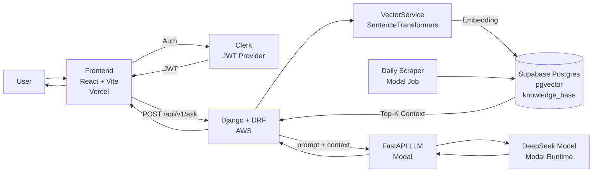
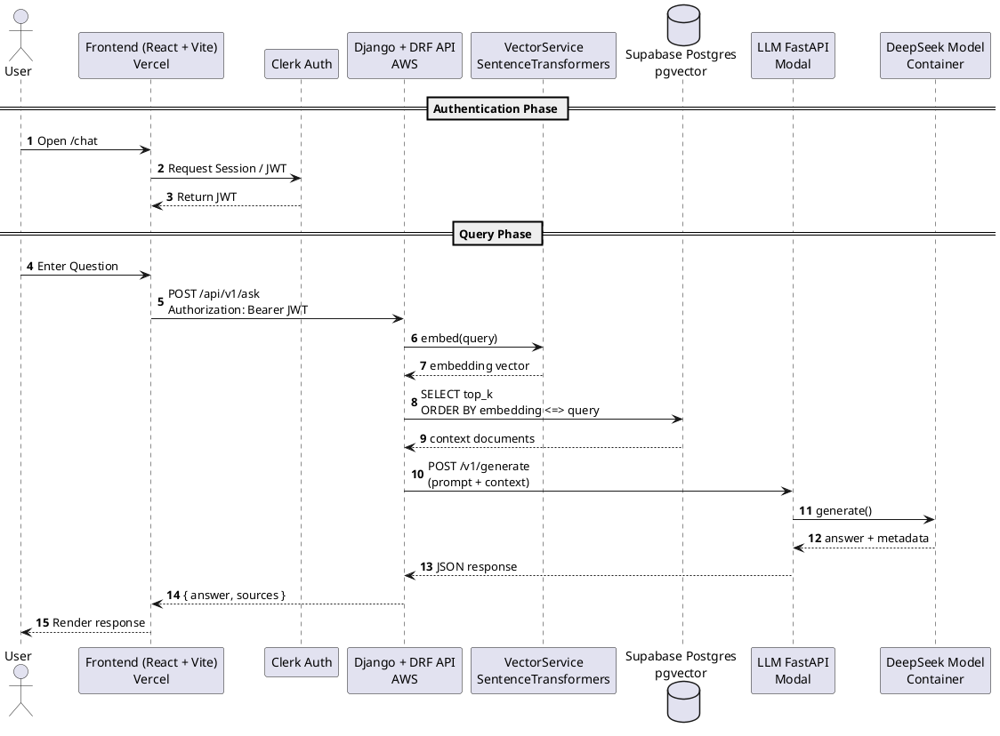

# Arthasetu AI – System Architecture Documentation

## Overview

This system is a Retrieval-Augmented Generation (RAG) architecture designed to:

1. Accept user regulatory queries
2. Retrieve relevant government circulars from vector database
3. Send context + query to LLM
4. Return grounded answer with sources

All major layers are deployed independently and maintained in separate GitHub repositories.

---

# 1 Mermaid – Architecture



---


# 1️2 PlantUML – Request Lifecycle (Sequence Diagram)

This avoids the “Clerk already defined” component conflict by using a pure `sequence` diagram.



---

# Repository Structure

| Layer | Technology | Deployment | Repo |
|--------|------------|------------|------|
| Frontend | React + Vite | Vercel | https://github.com/your-org/frontend-repo |
| Backend API | Django + DRF | AWS | https://github.com/your-org/backend-repo |
| LLM Service | FastAPI | Modal | https://github.com/your-org/llm-service-repo |
| Scraper / Ingestion | Python | Modal | https://github.com/your-org/scraper-repo |
| Database | Supabase (Postgres + pgvector) | Supabase Cloud | Managed |
| Authentication | Clerk | SaaS | Managed |

---

# 1. Frontend Layer (React + Vite)

## Responsibilities

- Chat UI
- Authentication via Clerk
- API calls to backend
- Render answer + citations

## Flow

1. User signs in via Clerk
2. Clerk provides JWT
3. Frontend sends JWT to backend

## API Call Example

```ts
const res = await apiPost("/ask", {
  query: query,
  context_filter: contextFilter,
});
```

---

# 2. Backend Layer (Django + DRF)

## Responsibilities

* Validate requests
* Retrieve vector context
* Call LLM
* Return answer + sources

## Endpoint

```
POST /api/v1/ask
```

## Internal Flow

```python
sources = vector_svc.find_context(query, top_k)
context_str = "\n".join([s["content"] for s in sources])
answer = llm_svc.get_reasoning(query, context_str)
```

---

# 3. Vector Retrieval Layer

Uses:

* SentenceTransformer("all-MiniLM-L6-v2")
* Supabase Postgres
* pgvector cosine similarity

## SQL Pattern

```sql
SELECT id, content, embedding <=> %s::vector AS distance
FROM knowledge_base
ORDER BY embedding <=> %s::vector
LIMIT %s;
```

---

# 4. LLM Layer (Modal FastAPI)

## Endpoint

```
POST /v1/generate
```

## Responsibilities

* Rate limiting
* Cold start handling
* Model invocation
* Return structured response

---

# 5. Database Layer (Supabase)

## Table: knowledge_base

```sql
CREATE TABLE knowledge_base (
  id uuid PRIMARY KEY,
  content text,
  metadata jsonb,
  embedding vector,
  doc_level text,
  effective_date date
);
```

---

# 6. Scraper / Ingestion Pipeline

Runs daily on Modal.

Steps:

1. Scrape new circulars
2. Parse PDF
3. Generate embedding
4. Insert into Supabase

---

# Full Request Lifecycle

User
→ Frontend
→ Clerk (JWT)
→ Backend
→ Vector search
→ LLM
→ Backend
→ Frontend
→ User

---

# Deployment Architecture

Frontend: Vercel
Backend: AWS EC2
LLM + Scraper: Modal
Database: Supabase
Auth: Clerk

---

# Security Model

* JWT verification in Django
* API key verification in Modal
* Rate limiting (30 req/min)
* HTTPS everywhere

---

# Known Limitations

1. No similarity threshold
2. No hybrid search (BM25 + vector)
3. No reranker
4. No answer caching
5. No semantic intent classification

---

# Improvement Plan (All Layers)

## Frontend Improvements

* Add streaming responses
* Add answer loading skeleton
* Add retry logic
* Add citation highlighting
* Add error boundary component
* Add token expiration auto refresh

---

## Backend Improvements

* Add similarity threshold

```sql
AND embedding <=> %s::vector < 0.35
```

* Add metadata filtering
* Add logging of retrieval distances
* Add Redis caching
* Add async view (ASGI)
* Add rate limiting middleware

---

## Vector Layer Improvements

* Add hybrid search (BM25 + vector)
* Add cross-encoder reranker
* Add embedding cache
* Tune ivfflat lists parameter

---

## LLM Layer Improvements

* Add strict grounding prompt:

"You must answer only using provided context. If insufficient context, say so."

* Add structured output schema
* Add answer confidence score
* Add token usage logging
* Add request tracing

---

## Database Improvements

* Partition by doc_level
* Add GIN index on metadata
* Enable pgBouncer
* Add query monitoring

---

## Scraper Improvements

* Add idempotency
* Add document diff detection
* Add retry queue
* Add PDF validation
* Add embedding batch processing

---

# Scalability Roadmap

Phase 1:

* Add Redis cache
* Add similarity threshold

Phase 2:

* Hybrid search
* Reranking
* Streaming responses

Phase 3:

* Horizontal scaling backend
* Dedicated embedding service
* Background queue

---

# Observability Recommendations

* Sentry (frontend + backend)
* Structured logging
* Latency metrics
* LLM token metrics
* Retrieval quality metrics

---

# Summary for Junior Developer

If you are new:

1. Understand RAG flow
2. Start from Backend AskView
3. Then study VectorService
4. Then inspect LLMService
5. Then check Supabase schema
6. Finally review scraper pipeline

Always ensure:

* Retrieval quality first
* Then prompt quality
* Then UI polish

RAG quality = Retrieval × Prompt × Data Quality


---

# 3️⃣ Major Architecture Improvements (Strategic)

If building for production-grade compliance AI:

### Add:

- API Gateway (AWS ALB)
- Redis Cache
- Hybrid Search
- Cross Encoder Reranker
- Background job queue
- Structured answer schema
- Retrieval confidence score
- Monitoring dashboard

---


